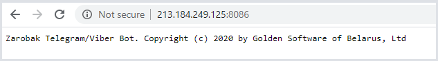

# Первоначальная настройка данных

Перед установкой бота на клиентской базе добавьте новый объект в файл customers.json, который содержит информацию о всех клиентах.

Файл customers.json расположен на сервере в папке data. Пример объекта:
 ```typescript
 "test": {
      "name": "Моя организация",
      "aliases": [
        "моя организация",
        "тест",
	      "test"
      ],
      "protected": "false"
    }
```
"test" - ИД организации,

- name - официальное наименование организации (используется для подсказки),

- aliases - массив возможных вариантов наименований организации, которыми могут пользоваться сотрудники,

- protected
  - "true", если необходима дополнительная защита по пин-коду,
  - "false" или отсутствие признака, если защита отключена.

# Экспорт данных из Гедымина

1. Для выгрузки данных из базы клиента установите пакет ПИ "ZarobakBot".

    Он включает в себя:

    - "ZarobakBot.Сбор данных". Содержит макросы для формирования json файлов с необходимой информацией из базы данных.

    - "ZarobakBot.Экспорт файлов". Содержит макросы для передачи информации на сервер.

    - "ZarobakBot.Экспорт данных по признакам". Содержит макросы для автоматической выгрузки данных расчетных листков (либо по закрытию месяца, либо по установке признака "Можно печатать" в "Итоговом начислении").

    - "ZarobakBot.Автозадача". Содержит автозадачи для выгрузки расчетных листков (во время расчета листков) и выгрузке меню столовой (каждый день). Автозадачи по умолчанию отключены, при установке автозадачи необходимо продублировать и заполнить необходимую информацию).

    - "ZarobakBot.Отчеты". Содержит отчет "ПИН-коды для бота" для организаций, которые использую дополнительную защиту по пин-коду.

2. Для работы с сервером заполните следующие значения констант в справочнике Исследователь » Сервис » Константы:

    - "ZarobakBot. ИД клиента". Константа, содержащая ИД записи клиента из файла customers.json ("gs", "bmkk" и т.д.).

    - "ZarobakBot. Адрес сервера" - http://213.184.249.125:8086 или http://zarobak.gdmn.app:8086.

      Проверить, есть ли соединение по адресу http://213.184.249.125:8086
        

    - "ZarobakBot. Сортировка меню столовой". Эта константа не заполняется, если на базе не установлен пакет "Гедымин: Общепит" или сортировка для групп меню столовой стандартная (по полю alias группы). Если сортировка по полю usr$numbersort, то значение константы указать = "1".

3. Запустите макросы из исследователя Зарплата и Отдел кадров » ZarobakBot:

    01. Экспорт расчетных листков. Макрос выполнит формирование json файлов:
        - employee.json, который содержит данные по сотрудникам организации,
        - accdedref.json, который содержит все виды начислений и удержаний,
        - расчетных листков.

    02. Экспорт табелей. Макрос выполнит формирование json файлов:
        - с информацией по табелям отработанного времени для каждого сотрудника.

    03. Экспорт графиков. Макрос выполнит формирование json файла:
        - schedules.json, который содержит информацию по графикам рабочего времени.

    04. Экспорт меню столовой. Макрос выполнит формирование json файла:
        - menu.json, который содержит информацию по меню на текущую дату.

Данные для экспорта сотрудников вытягиваются за период, который будет запрашиваться параметром.

Макросы экспорта данных состоят из 2 основных частей:
  1. Выполнение запросов и подготовка данных в JSON формате;
  2. Отправка файлов на сервер.

# Рассылка сообщений пользователям о том, что появился новый расчетный листок (в плане)

После загрузки нового расчетного листка будет выполнена рассылка сообщения о новых данных
всем сотрудникам из файла employee.json соответствующей организации.

Единица выгрузки из базы данных это один расчетный листок, за один целый календарный месяц, по одному сотруднику.

Подразделение и должность, график, форма оплаты (чтс\оклад) определяется на дату окончания
месяца расчетного листка. И всегда передается вместе
с расчетным листком.

Если человек в один месяц работал в одном подразделении,
в другой -- в другом, то у него в каждом расчетном листке
будет сохранено соответствующее подразделение.

Если человек в течение месяца переводился из подразделения в подразделение или с должности на должность, то в расчетный листок попадет только последнее.