# Подключение ZarobakBot в Telegram Desktop для Windows
Существует несколько способов подключения чат-бота ZarobakBot в приложении Telegram:
- По ссылке
- Через поле поиска приложения

## Подключение по ссылке
1. Перейдите по ссылке https://telegram-zarobakbot.gdmn.app

   и нажмите на кнопку «Open Telegram Desktop», чтобы открыть бот в Telegram Desktop:

   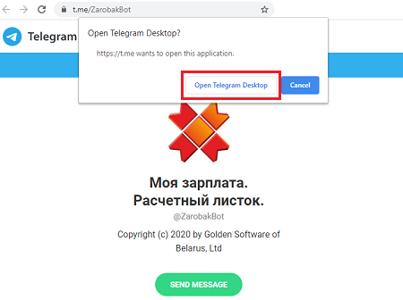

2. В открывшемся окне чат-бота, нажмите на кнопку «Запустить»:

   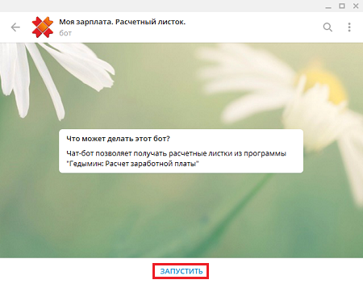

## Подключение через поле поиска в приложении
1. Откройте Telegram Desktop и нажмите на клавиатуре клавишу «Esc».

   Откроется поле поиска, где введите наименование бота - ZarobakBot:

   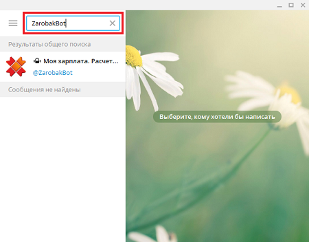
2. Выберите чат из появившегося списка и нажмите на кнопку «Запустить»:

   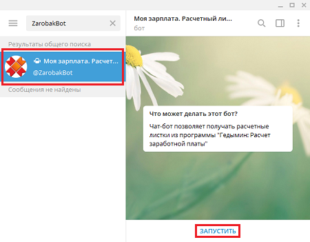

# Регистрация в системе ZarobakBot
1. После того, как Вы подключились к чат-боту, выберите пункт меню «Зарегистрироваться»:

   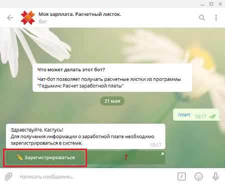

2. Введите наименование организации:

   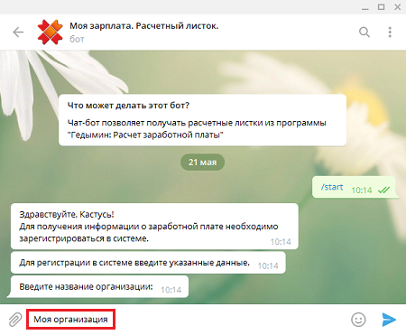

3. Введите попорядку фамилию, имя, отчество, идентификационный номер из паспорта:

   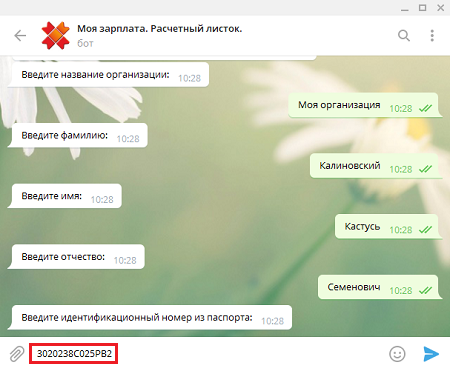
4. При удачной регистрации в чат-боте появится основное меню:

   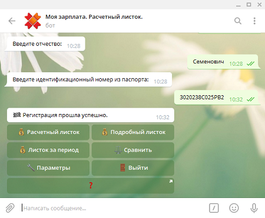

   Если же Вам не удастся зарегистрироваться, обратитесь в бухгалтерию вашей организации для уточнения данных.

# Функционал ZarobakBot
Основное меню чат-бота ZarobakBot состоит из следующих пунктов меню:
- Пункт меню «Расчетный листок» выведет на экран Ваш последний рассчитанный листок:

   
- Пункт меню «Подробный листок» выведет на экран Ваш последний рассчитанный листок

   с подробно описанными начислениями, вычетами и налогами:

   
- Пункт меню «Листок за период» выведет на экран расчетный листок за необходимый вам период.

  Выберите пункт «Листок за период» и укажите сначала начало периода,

  а затем окончание периода:

   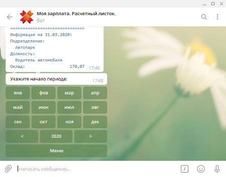

  Если Вы хотите увидеть расчетный листок за один месяц, то выберите один и тот же месяц начала и окончания.

  Если Вы хотите увидеть расчетный листок за другой год, воспользуйтесь кнопками со стрелками

  - влево (<), если год надо уменьшить,
  - вправо (>), если год надо увеличить.

- Пункт меню «Сравнить» выведет на экран данные по расчетным листкам за два периода, подсчитав разницу.

   Выберите пункт «Сравнить» и укажите сначала начало и окончание первого периода,

   а затем начало и окончание второго периода:

   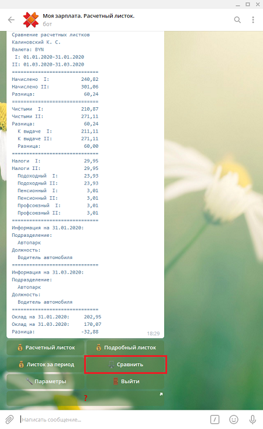

- Пункт меню «Параметры». Если Вы хотите увидеть свой расчетный листок в другой валюте,

  то выберите пункт «Параметры» и далее пункт «Выбрать валюту».

  Из появившегося меню со списком валют выберите необходимую вам (евро, доллар США, российский рубль или белорусский рубль):

   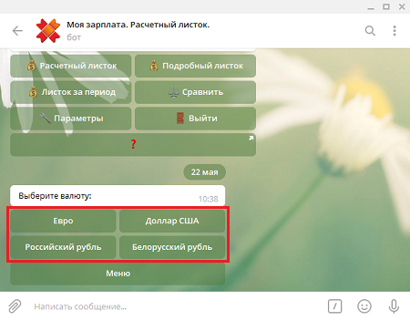

  При последующих запросах расчетные листки будут выводится в выбранной вами валюте,

  пересчитанные по курсу валюты Нацбанка РБ на дату начала период:

   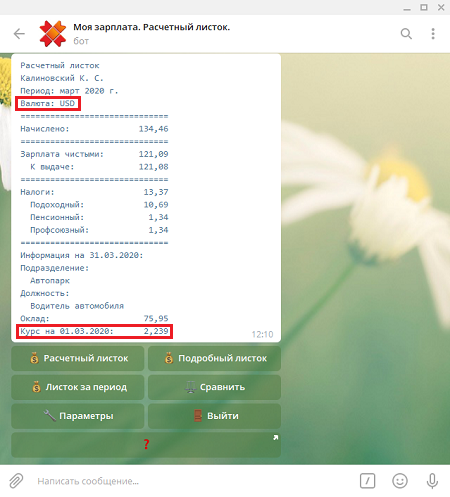

  Для возврата в основное меню воспользуйтесь кнопкой «Меню».

- Пункт меню «Выйти». Чтобы выйти из системы ZarobakBot, нажмите на этот пункт.

  Если Вы захотите снова просмотреть Ваши расчетные листки, Вам придется заново зарегистрироваться.

- Чтобы подробнее узнать о нас и наших разработках, можно воспользоваться пунктом меню с вопросительным знаком.

  Вам будет предложено перейти на наш сайт http://gsbelarus.com/:

   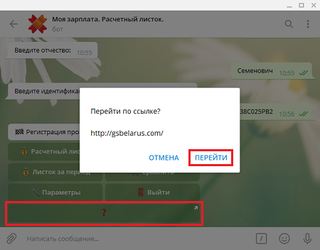
