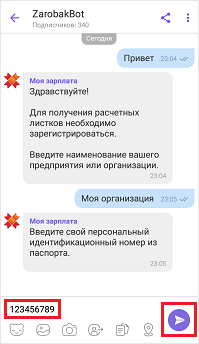
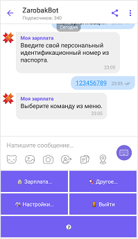
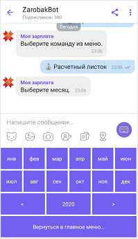
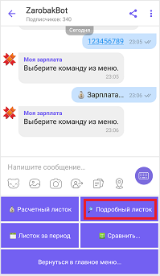
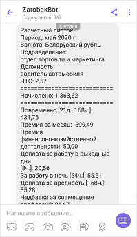
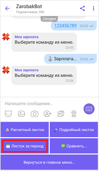
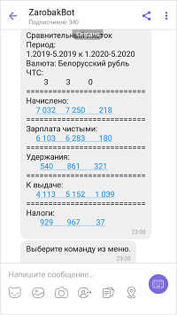
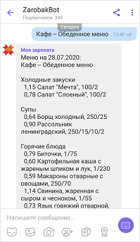
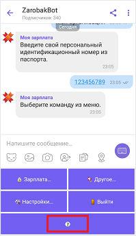
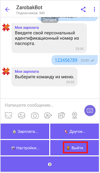

# Подключение ZarobakBot в приложении Viber

  Подключиться к боту можно несколькими способами:

  - при помощи QR-кода
  - по ссылке

   ## Подключение при помощи QR-кода.

  1. В Viber выберите пункт «Ещё» в нижнем меню приложения:

      

  2. Нажмите на значок сканера в верхнем правом углу открывшегося окна:

      

  3. Наведите квадрат сканера в центре экрана на данный QR-код:

      .

  4. В открывшемся окне нажмите на кнопку «Сообщение»:

      .

  5. В строке ввода напишите сообщение, например «Привет».

      Нажмите кнопку «Отправить»:

      .

      Теперь вы подписаны на бот и вам необходимо зарегистрироваться.

      .

  ## По ссылке

  Для подключения к боту также можно использовать ссылку - [нажмите сюда](viber://pa?chatURI=zarobakbot"> "ссылка Viber").

  Далее выполнить пункты 4 и 5 из списка выше.

# Регистрация в системе ZarobakBot

1. После того, как Вы подключились к чат-боту, введите наименование вашей организации и нажмите кнопку «Отправить»:

   

2. Введите ваш идентификационный номер из паспорта и нажмите кнопку «Отправить»:

   

    При удачной регистрации в чат-боте появится основное меню:

   

   Если же Вам не удастся зарегистрироваться, обратитесь в бухгалтерию вашей организации для уточнения данных.

# Функционал ZarobakBot

## Меню «Зарплата».

  Нажмите пункт меню «Зарплата» для просмотра Ваших расчетных листков:

  

  Выберите вид отображаемого листка:

  

  - Пункт меню «Расчетный листок» выведет на экран Ваш краткий расчетный листок.

    Выберите пункт меню «Расчетный листок» и укажите интересующий вас месяц:

        

    Если Вам необходимо выбрать другой год, воспользуйтесь кнопками со стрелками:

    - влево (<), если год надо уменьшить,
    - вправо (>), если год надо увеличить.

  - Пункт меню «Подробный листок» выведет на экран Ваш расчетный листок с подробно описанными начислениями, вычетами и налогами.

    Выберите пункт меню «Подробный листок» и укажите интересующий вас месяц:

    

         

  - Пункт меню «Листок за период» выведет на экран Ваш расчетный листок с подробно описанными начислениями, вычетами и налогамиа за период.

    Выберите пункт меню «Листок за период» и укажите сначала начало периода, а затем окончание:

    

         

  - Пункт меню «Сравнить» выведет на экран данные по расчетным листкам за два периода, подсчитав разницу.

    Выберите пункт «Сравнить» и укажите сначала начало и окончание первого периода, а затем начало второго периода (окончание второго периода рассчитается автоматически, взяв столько же месяцев, сколько в первом периоде). Суммы в сравнительном листке округлены до рублей:

      

### Меню «Другое»

  Меню «Другое» содержит в себе дополнительный функционал:

  

- Пункт меню «График» отобразит график рабочего времени сотрудника.

  Нажмите на пункт «График», выберите месяц:

    

- Пункт меню «Табель» покажет табель отработанного времени сотрудника.

  Нажмите на пункт «Табель», выберите месяц:

    

- Пункт меню «Дни рождения» выведет именинников из Вашей организации за текущий и следующий день.

  Нажмите на пункт «Дни рождения»:

    

- Пункт меню «Курсы валют» позволяет увидеть курсы валют за месяц.

  Нажмите на пункт «Курсы валют», выберите валюту и интересующий Вас месяц:

  

    

- Пункт меню «Меню столовой» выведет меню столовой на текущий день.

  Нажмите на пункт «Меню столовой», выберите тип меню:

  

    

- Пункт меню «Доска объявлений» позволяет отправить сообщение сотрудникам своего подразделения.

  Нажмите на пункт «Доска объявлений»:

  - Введите сообщение:

    

  - Выберите тип рассылки («Разослать всем в подразделении»):

    

  - Подтвердите рассылку:

    

  По завершению рассылки придет сообщение о результате выполнения.

    

## Меню «Настройки».

Меню «Настройки» содержит следующее:

- Пункт меню «Выбрать валюту» позволит Вам выбрать валюту, в которой Вы хотите видеть данные вашего расчетного листка.

  Нажмите «Выбрать валюту». Из появившегося меню со списком валют выберите необходимую Вам (доллар США, евро, российский рубль, польский злотый, украинская гривна или белорусский рубль). Для просмотра всех валют воспользуйтесь скроллом:

   

  При последующих запросах расчетные листки будут выводится в выбранной вами валюте, пересчитанные по курсу валюты Нацбанка РБ на дату начала период:

   

- Пункт меню «Выбрать язык» позволит выбрать язык общения с ботом (белорусккий, русский или английский).

   

## Пункт меню «?».

Чтобы подробнее узнать о нас и наших разработках нажмите на этот пункт.

Вам будет предложено перейти на наш сайт http://gsbelarus.com/:

  

## Пункт меню «Выйти».

Чтобы выйти из системы ZarobakBot, нажмите на этот пункт.

Если Вы захотите снова просмотреть Ваши расчетные листки, Вам придется заново зарегистрироваться.
